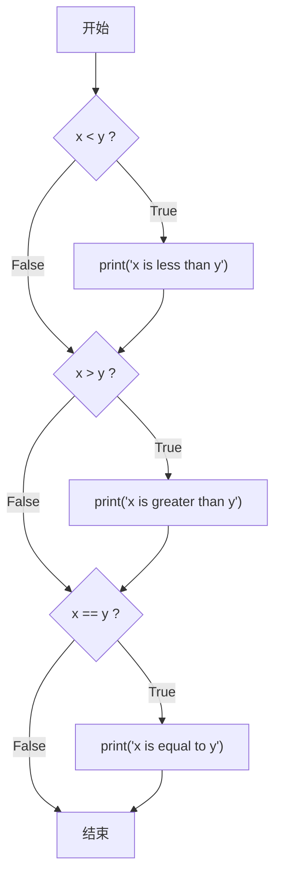
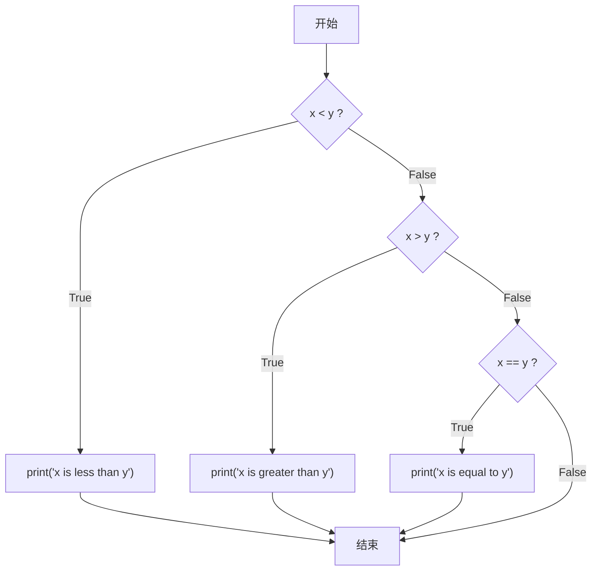
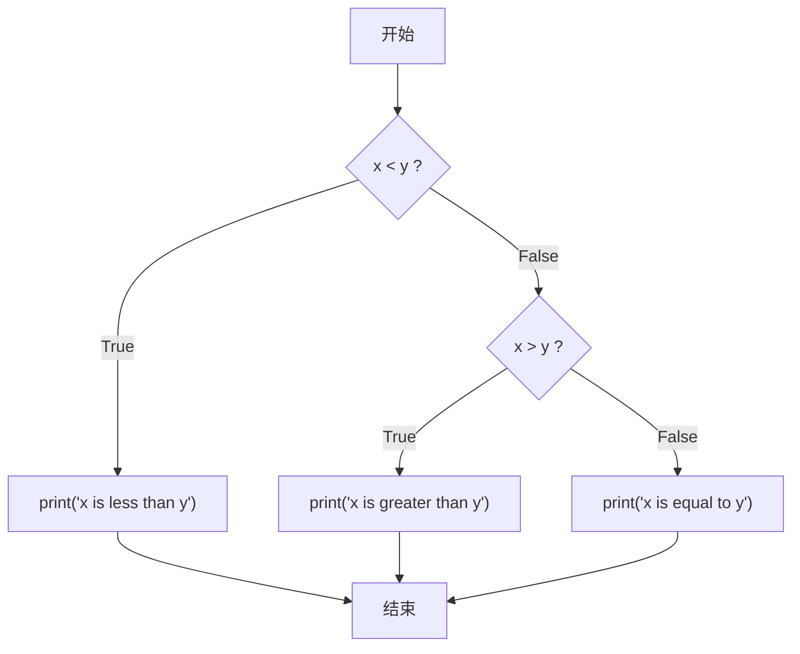

# Python 第二课：条件语句 (Conditionals)

## 什么是条件语句 (Conditionals)

条件语句 (`Conditionals`) 允许你的程序根据特定条件做出决策，就像在岔路口选择走左边的路还是右边的路一样。

Python 内置了一系列“操作符” (`operators`)，用于进行数学问题的比较。

*   `>`: 大于
*   `<`: 小于
*   `>=`: 大于或等于
*   `<=`: 小于或等于
*   `==`: 等于 (注意是双等号。单个等号 `=` 用于赋值 `assign`，而双等号 `==` 用于比较 `compare` 值)
*   `!=`: 不等于

条件语句 (`conditional statements`) 通过比较左侧项和右侧项来工作。

## `if` 语句 (if Statements)

`if` 语句使用布尔值 (`bool` / `Boolean`) —— `True` 或 `False` —— 来决定是否执行一段代码。如果条件为 `True`，解释器 (`interpreter`) 就会运行缩进的代码块。

**示例:**
创建一个名为 `compare.py` 的文件。

```python
# 获取用户输入并转换为整数 (integer)
x = int(input("What's x? "))
y = int(input("What's y? "))

# 如果 x 小于 y
if x < y:
    print("x is less than y")
```
在这个例子中，程序会获取用户为 `x` 和 `y` 输入的值，并将它们存入相应的变量 (`variables`)。然后，`if` 语句比较 `x` 和 `y`。如果 `x < y` 这个条件满足 (即为 `True`)，那么 `print` 语句就会被执行。

## 控制流 (Control Flow)、`elif` 和 `else`

`Control flow` (控制流) 是程序执行决策的流程。

**1. 多个 `if` 语句**
```python
x = int(input("What's x? "))
y = int(input("What's y? "))

if x < y:
    print("x is less than y")
if x > y:
    print("x is greater than y")
if x == y:
    print("x is equal to y")
```
这种写法中，程序会依次检查每一个 `if` 条件，无论前面的条件是否满足。这在逻辑上是低效的，因为这三个条件是互斥的。

这个流程可以用下面的流程图表示：


**2. 使用 `elif` 改进**
我们可以使用 `elif` (else if 的缩写) 来优化代码，让程序在找到一个满足的条件后就停止检查。

```python
x = int(input("What's x? "))
y = int(input("What's y? "))

if x < y:
    print("x is less than y")
elif x > y:
    print("x is greater than y")
elif x == y:
    print("x is equal to y")
```
这里，如果 `x < y` 为 `True`，程序将不会再检查后面的 `elif` 条件。如果 `x < y` 为 `False`，它才会去检查 `elif x > y`。

这个流程可以用下面的流程图表示：


**3. 使用 `else` 最终优化**
逻辑上，如果 `x` 既不小于 `y`，也不大于 `y`，那么它必然等于 `y`。所以我们不需要明确检查 `x == y`，而是可以使用 `else` 作为“全捕捉” (`catch-all`) 的默认情况。

```python
x = int(input("What's x? "))
y = int(input("What's y? "))

if x < y:
    print("x is less than y")
elif x > y:
    print("x is greater than y")
else:
    print("x is equal to y")
```
这个版本逻辑更清晰，也更高效。

这个流程可以用下面的流程图表示：



## `or` 关键字

`or` 关键字允许你在一个条件中检查多个可能性，只要其中一个为 `True`，整个条件就为 `True`。

```python
x = int(input("What's x? "))
y = int(input("What's y? "))

if x < y or x > y:
    print("x is not equal to y")
else:
    print("x is equal to y")
```

当然，这段代码有更好的实现方式，比如直接使用 `!=` 操作符：

```python
x = int(input("What's x? "))
y = int(input("What's y? "))

if x != y:
    print("x is not equal to y")
else:
    print("x is equal to y")
```
或者反过来，先判断相等的情况：
```python
x = int(input("What's x? "))
y = int(input("What's y? "))

if x == y:
    print("x is equal to y")
else:
    print("x is not equal to y")
```
这两种写法都只问了一个问题，非常高效。

## `and` 关键字

`and` 关键字要求所有条件都为 `True` 时，整个条件才为 `True`。

**示例：`grade.py`**
```python
score = int(input("Score: "))

if score >= 90 and score <= 100:
    print("Grade: A")
elif score >= 80 and score < 90:
    print("Grade: B")
elif score >= 70 and score < 80:
    print("Grade: C")
elif score >= 60 and score < 70:
    print("Grade: D")
else:
    print("Grade: F")
```

**代码改进：**
Python 允许你像数学中一样链式书写比较，这在其他语言中不常见。
```python
score = int(input("Score: "))

if 90 <= score <= 100:
    print("Grade: A")
# ...
```

**最佳实践：**
利用 `if-elif` 的流程控制，我们可以写出更简洁、更易于维护的代码。
```python
score = int(input("Score: "))

if score >= 90:
    print("Grade: A")
elif score >= 80:
    print("Grade: B")
elif score >= 70:
    print("Grade: C")
elif score >= 60:
    print("Grade: D")
else:
    print("Grade: F")
```
在这个版本中，如果一个分数是 95，它满足 `score >= 90`，程序打印 "Grade: A" 后就会退出条件判断，不会再检查 `elif score >= 80`，这正是我们想要的结果。

> 更多信息可以查阅 Python 官方文档中关于 [control flow](https://docs.python.org/3/tutorial/controlflow.html) 的部分。

## 模运算 (`Modulo`)

在数学中，`parity` (奇偶性) 指的是一个数是偶数还是奇数。

`Modulo` (模) 运算符 `%` 可以计算两个数相除的余数。
*   `4 % 2` 的结果是 `0`，因为它们可以整除。
*   `3 % 2` 的结果是 `1`，因为有余数。

**示例：`parity.py`**
我们可以用它来判断一个数的奇偶性。
```python
x = int(input("What's x? "))

if x % 2 == 0:
    print("Even")
else:
    print("Odd")
```

## 创建我们自己的奇偶性函数 (Creating Our Own Parity Function)

将常用功能封装成自定义函数 (`function`) 是一个好习惯。

```python
def main():
    x = int(input("What's x? "))
    if is_even(x):
        print("Even")
    else:
        print("Odd")

def is_even(n):
    if n % 2 == 0:
        return True
    else:
        return False

main()
```
注意，`if is_even(x):` 这行代码能工作，是因为 `is_even` 函数返回了一个布尔值 (`bool`)：`True` 或 `False`。`if` 语句直接根据这个返回值来做判断。

## `Pythonic` 风格

`Pythonic` 是指一种具有 Python 语言鲜明特色的编程风格，通常意味着代码简洁、易读。

我们可以用更 `Pythonic` 的方式重写 `is_even` 函数。

**版本 1：三元运算符**
```python
def is_even(n):
    return True if n % 2 == 0 else False
```
这一行代码读起来就像一个英文句子，是 Python 特有的写法。

**版本 2：更简洁的 `Pythonic` 风格**
`n % 2 == 0` 这个表达式本身就会得出一个布尔值 (`True` 或 `False`)，所以我们可以直接返回它的结果。
```python
def is_even(n):
    return n % 2 == 0
```
这是最简洁、最 `Pythonic` 的写法。

## `match` 语句

`match` 语句（在 Python 3.10 中引入）可以作为 `if-elif-else` 的一种替代方案，用于匹配特定的值。

**`if-elif-else` 示例：**
```python
name = input("What's your name? ")

if name == "Harry" or name == "Hermione" or name == "Ron":
    print("Gryffindor")
elif name == "Draco":
    print("Slytherin")
else:
    print("Who?")
```

**使用 `match` 语句实现：**
`match` 语句会将 `match` 后面的值与每个 `case` 后的值进行比较。一旦找到匹配项，就会执行相应的代码块，然后停止匹配。
```python
name = input("What's your name? ")

match name:
    case "Harry":
        print("Gryffindor")
    case "Hermione":
        print("Gryffindor")
    case "Ron":
        print("Gryffindor")
    case "Draco":
        print("Slytherin")
    case _:
        print("Who?")
```
`case _` 中的下划线 `_` 是一个通配符，可以匹配任何其他情况，作用类似于 `else`。

**使用 `|` 改进 `match` 语句：**
我们可以使用 `|` (逻辑或) 将多个 `case` 合并成一个。
```python
name = input("What's your name? ")

match name:
    case "Harry" | "Hermione" | "Ron":
        print("Gryffindor")
    case "Draco":
        print("Slytherin")
    case _:
        print("Who?")
```

## 总结 (Summing Up)

通过本节课的学习，你已经掌握了在 Python 中使用条件语句来让程序根据不同情况采取相应行动的能力。我们讨论了以下内容：

*   条件语句 (`Conditionals`)
*   `if` 语句 (`if Statements`)
*   控制流 (`Control flow`)、`elif` 和 `else`
*   `or` 关键字
*   `and` 关键字
*   模运算 (`Modulo`)
*   创建自定义函数 (`Creating your own function`)
*   `Pythonic` 编程风格 (`Pythonic coding`)
*   `match` 语句